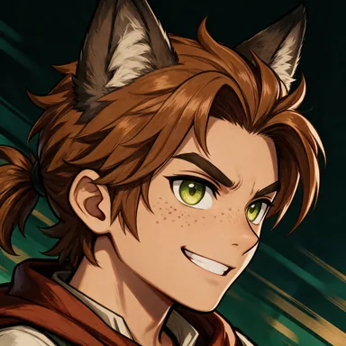
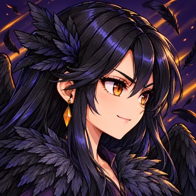
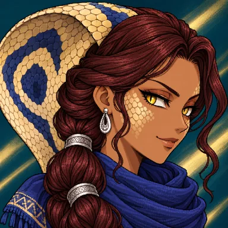
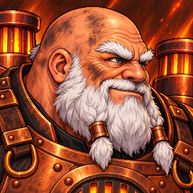
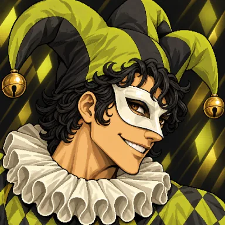
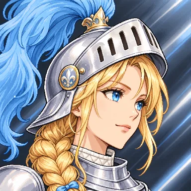
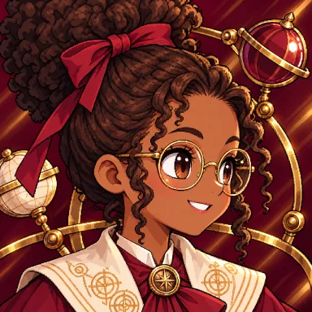
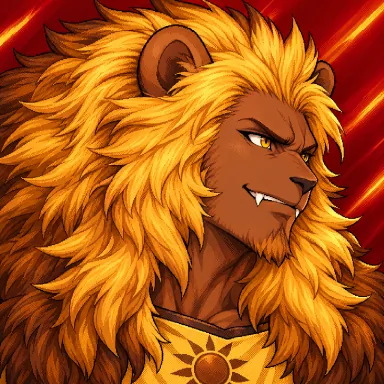
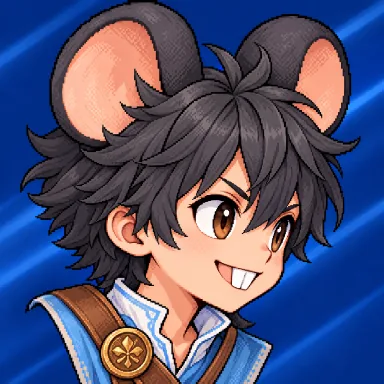
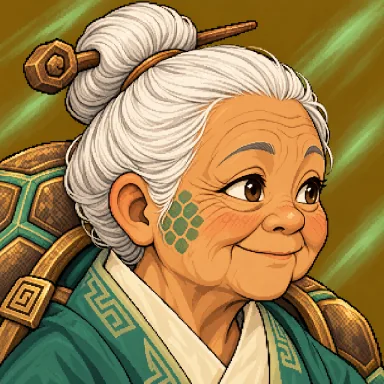

<div align="center">

# ⚔️ AETHER CLASH

**A 2D browser fighting game — Mecha vs Demi-Human.**
Twelve chibi fighters, cinematic ultimates and a CPU that reads your moves. Runs in any modern browser, on desktop and mobile, with no install.

[](https://bangtutorial.id/aether-clash/)
[](https://www.youtube.com/watch?v=UN_0bNC2wTU)


[](LICENSE)
[](LICENSE-ASSETS.md)


</div>

---

## 📺 Tutorial

The whole game — fighters, animations, voices and code — was made step by step on YouTube (in Bahasa Indonesia):

<a href="https://www.youtube.com/watch?v=UN_0bNC2wTU">
  
</a>

**[Bikin Game Fighting Pakai ChatGPT (GPT-6 Astra + Higgsfield MCP)](https://www.youtube.com/watch?v=UN_0bNC2wTU)** — by **Bang Tutorial**

## 📑 Contents

- [Features](#-features)
- [Screenshots](#-screenshots)
- [Roster](#-roster)
- [Controls](#-controls)
- [Getting started](#-getting-started)
- [Deployment](#-deployment)
- [Project structure](#-project-structure)
- [Guides](#-guides)
- [How it works](#-how-it-works)
- [Credits](#-credits)
- [License](#-license)

## ✨ Features

- **12 playable fighters** in two factions (6 Mecha, 6 Demi-Human). Each has a 3-hit basic chain, two skills and an ultimate with a full-screen cut-in and a voice line.
- **VS Computer**: best of 3 rounds, 90 seconds each, with **4 CPU levels** (Easy, Medium, Hard, Excellent). The CPU dodges projectiles, punishes whiffs, anti-airs jumps and only continues combos that actually landed.
- **Training mode** with unlimited time, a passive dummy, a combo tracker and a hitbox view.
- **5 arenas**: Bellora Courtyard, Sunspire Terrace, Azure Harbor, Elderwood Glade and Moonrise Bastion.
- **Announcer** calls for character select, rounds, K.O. and the winner.
- **Mobile ready**: phones open a landscape shell with touch controls (d-pad plus MOBA-style skill buttons with cooldown timers) and a fullscreen button.
- **Fast loading**: the first visit downloads every asset behind a progress screen (about 34 MB); after that a service worker serves images from the cache, so screens change instantly and reloads are near-instant.
- **Settings**: master volume, background music, sound test, hitboxes and fullscreen.
- **No framework, no build step**: plain HTML, CSS and JavaScript with Canvas 2D. Deploy it as static files anywhere.

## 🖼️ Screenshots

<table>
  <tr>
    <td width="50%"><br><sub><b>Character select</b> — 12 fighters, player then rival then arena</sub></td>
    <td width="50%"><br><sub><b>VS Computer</b> — SOLAN's Solar Crescent at Moonrise Bastion</sub></td>
  </tr>
  <tr>
    <td width="50%"><br><sub><b>Ultimate cut-in</b> — EDDA calls the Elder Tortoise</sub></td>
    <td width="50%"><br><sub><b>Ultimate</b> — the spirit stomps three times</sub></td>
  </tr>
  <tr>
    <td colspan="2" align="center"><br><sub><b>Mobile</b> — landscape layout with touch controls</sub></td>
  </tr>
</table>

## 🥊 Roster

| | Fighter | Faction | Style | Basic | Ultimate |
| :-: | --- | --- | --- | --- | --- |
|  | **ARCO** — The Aether Arm | Mecha | Brawler / drone summon | Iron Chain | Helios Squadron |
|  | **FENR** — The Wolf Ranger | Demi-Human | Agile / werewolf transformation | Ranger Chain | Feral Awakening |
|  | **MIRA** — The Candy Pilot | Mecha | Heavy mech / rocket barrage | Mitten Chain | Rocket Parade |
|  | **CORA** — The Raven Dancer | Demi-Human | Agile / raven swarm | Feather Waltz | Night Murmuration |
|  | **NAJA** — The Dune Cobra | Demi-Human | Mid-range / urumi whip and sand serpent | Viper Lash | Dune Serpent |
|  | **HALDOR** — The Walking Forge | Mecha | Heavy tank / steam forge hammer | Forge Chain | Forge Quake |
|  | **ZANNI** — The Clockwork Jester | Mecha | Trickster / scissor arms and bladed rings | Scissor Jab | Grand Finale |
|  | **ISOLDE** — The White Strider | Mecha | Long-range lancer / stilt-leg charges | Lance Line | Skyfall Lances |
|  | **RHEA** — The Little Orrery | Mecha | Zoner / orbiting orrery spheres | Orbit Strike | Grand Orrery |
|  | **SOLAN** — The Sunmane | Demi-Human | Powerhouse / greatsword and roar | Sunblade | Sunmane Roar |
|  | **NIB** — The Rooftop Post | Demi-Human | Rushdown / twin courier batons | Baton Flurry | Special Delivery |
|  | **EDDA** — The Shell Sage | Demi-Human | Counter defender / staff and shell guard | Staff Forms | Elder Tortoise |

## 🎮 Controls

### Keyboard

| Key | Action |
| --- | --- |
| `A` / `D` | Move left / right |
| Double-tap `A` / `D` and hold | Run |
| `W` | Jump (press again in the air to double jump) |
| `S` | Crouch on the ground, fast fall in the air; double-tap for a somersault double jump |
| `Space` | Basic attack (tap up to 3 times for the full chain) |
| `I` | Skill 1 |
| `O` | Skill 2 |
| `P` | Ultimate |
| `Esc` | Pause / resume |
| `R` | Restart (the round in Training, the match in VS Computer) |

Skills cancel a basic attack at any moment. The ultimate pose locks you for only 0.5 s; the summon then finishes on its own while you keep fighting.

In the menus: `W A S D` / arrow keys to select, `Enter` to confirm, `Esc` to go back.

### Touch (phones and tablets)

- **Left**: ◀ ▼ ▶ with ▲ above ▼. Slide your finger between buttons; double-tap ◀/▶ to run, tap ▲ again in the air to double jump.
- **Right**: a big **Basic Attack** button with **Skill 1 / Skill 2 / Ultimate** around it, showing each fighter's icons and cooldowns.
- Phones open `mobile.html` automatically in landscape. Add `?touch=1` to force the mobile layout on desktop, or `?touch=0` to turn it off.

## 🚀 Getting started

The game is a set of static files, so there is nothing to install or build.

```bash
git clone https://github.com/<your-username>/aether-clash.git
cd aether-clash

# any static file server works, for example:
python -m http.server 8000
# or
npx serve .
```

Then open <http://localhost:8000/>.

> [!TIP]
> Serve the folder over `http://localhost` or HTTPS to get the loading screen and the service-worker cache. Opening `index.html` straight from disk (`file://`) still plays, just without caching.

**Browser support:** current Chrome, Edge, Firefox and Safari (desktop and mobile). Audio starts after the first click or tap, because browsers require a user gesture.

## 🌐 Deployment

Upload the folder to any static host (nginx, Apache, LiteSpeed, Caddy, GitHub Pages, Netlify and so on). All paths are relative, so it works at a domain root or in a subfolder such as `https://example.com/aether-clash/`.

Server checklist:

- Open the game **with the trailing slash** (`/aether-clash/`) and redirect `/aether-clash` to it.
- Serve `.js` as JavaScript, `.webp` as `image/webp`, `.mp3` as `audio/mpeg`, `.mp4` as `video/mp4` and `.ttf` as `font/ttf`.
- Send `Cache-Control: no-cache` for the game files. The game keeps its own hashed copies in Cache Storage, so updates show up immediately.
- Serve MP3/MP4 files with range requests (the default for static files) and without gzip.

Step-by-step instructions for nginx, Apache/LiteSpeed and Caddy, plus a script that checks every file after upload, are in **[DEPLOY.md](DEPLOY.md)**. An `.htaccess` for Apache/LiteSpeed is included.

## 🗂️ Project structure

```text
.
├── index.html        # desktop entry: menu, HUD, dialogs, script order
├── mobile.html       # landscape shell for phones (rotation, fullscreen)
├── style.css         # arena HUD, cut-ins, touch controls
├── menu.css          # main menu, character and arena select, results
├── game.js           # engine: loop, physics, combat, CPU brain, summons, rendering, HUD
├── menu.js           # front end: menu flow, roster, arena and difficulty select
├── match.js          # match rules: rounds, timer, stages, difficulty tuning
├── announcer.js      # announcer voice queue
├── touch.js          # on-screen touch controls
├── fenr.js … edda.js # one kit file per fighter (moves, balance, timings)
├── preload.js        # first-visit loading screen, fills the cache
├── precache.js       # generated list of runtime files with sizes and hashes
├── sw.js             # service worker: cache-first images, network-first code
├── files.json        # file list with sizes (used by the deploy check)
├── LICENSE           # MIT (source code)
├── LICENSE-ASSETS.md # CC BY-NC 4.0 (art, audio, guides) and exceptions
├── guide/            # design and production guides (Bahasa Indonesia)
├── docs/screenshots/ # images for this README
└── assets/
    ├── <fighter>/    # sprite atlas (WebP) + manifest.js, portrait, icons, cut-in, FX, voice
    ├── audio/        # announcer clips and background music
    ├── menu/         # menu art, arena backgrounds, character select art
    ├── ui/           # shared HUD art (ARCO kit, drone, cut-in)
    └── fonts/        # Rajdhani (SIL Open Font License)
```

## 📚 Guides

The [`guide/`](guide/) folder holds the design and production notes behind the game (in Bahasa Indonesia). Start from [guide/README.md](guide/README.md).

| Topic | Guide |
| --- | --- |
| Adding a new fighter, step by step | [character-workflow.md](guide/character-workflow.md) |
| Shared gameplay rules (movement, combos, HP, cooldowns) | [gameplay-standard.md](guide/gameplay-standard.md) |
| Sprite prompts, pipeline, QA and known issues | [sprite-prompts.md](guide/sprite-prompts.md), [sprite-pipeline.md](guide/sprite-pipeline.md), [sprite-qa.md](guide/sprite-qa.md), [sprite-known-issues.md](guide/sprite-known-issues.md) |
| CPU brain and difficulty benchmark | [cpu-ai.md](guide/cpu-ai.md) |
| Menu flow and match rules | [main-menu.md](guide/main-menu.md) |
| Announcer and ultimate voices | [announcer-system.md](guide/announcer-system.md), [ultimate-voice.md](guide/ultimate-voice.md) |
| Arena backgrounds and menu video | [stage-background.md](guide/stage-background.md), [menu-video.md](guide/menu-video.md) |
| One reference per fighter (kit, balance, assets, voice) | [arco](guide/arco-reference.md) · [fenr](guide/fenr-reference.md) · [mira](guide/mira-reference.md) · [cora](guide/cora-reference.md) · [naja](guide/naja-reference.md) · [haldor](guide/haldor-reference.md) · [zanni](guide/zanni-reference.md) · [isolde](guide/isolde-reference.md) · [rhea](guide/rhea-reference.md) · [solan](guide/solan-reference.md) · [nib](guide/nib-reference.md) · [edda](guide/edda-reference.md) |

The guides also mention the full production workspace (raw generation sources, pipeline tools, sprite lab pages). Those are several GB and are not part of this repository.

## 🔧 How it works

- **Fixed-step simulation.** The game advances in 1/120 s steps with a seeded random generator, so combat plays the same way on every machine.
- **Sprites.** Each fighter is a WebP sprite atlas (idle, walk, run, jump, crouch, three attacks, two skills, ultimate, hurt, down and recover) with a manifest of frames, foot anchors and measured hit points. Sprites are drawn pixel-exact, never rescaled at runtime.
- **Kits.** The rules for each fighter (damage, reach, cooldowns, projectile and summon behaviour) live in their own small file. The player and the CPU use exactly the same kit.
- **CPU brain.** The CPU reacts with a human-like delay: it jumps projectiles, backs out of attacks, punishes recovery, anti-airs and confirms combos. Each difficulty level changes reaction time, aggression and mistakes.
- **Loading.** `precache.js` lists every runtime file with a content hash. `preload.js` downloads them into Cache Storage behind the loading screen, and `sw.js` serves images and fonts from there. On later visits only files whose hash changed are downloaded again.

## 🙏 Credits

- **Game design and development**: [Bang Tutorial](https://www.youtube.com/watch?v=UN_0bNC2wTU)
- **Visuals**: generated with Higgsfield (GPT Image)
- **Voices and announcer**: ElevenLabs voices via Higgsfield
- **Typography**: [Rajdhani](https://fonts.google.com/specimen/Rajdhani) by Indian Type Foundry, under the SIL Open Font License (see `assets/fonts/OFL.txt`)
- **Background music**: "Midday Showdown", generated with [Suno](https://suno.com)

## 📄 License

- **Source code** (HTML, CSS, JavaScript) is released under the [MIT License](LICENSE).
- **Assets** (characters, sprites, artwork, effects, video, voices, background music, screenshots and the `guide/` documents) are released under [CC BY-NC 4.0](LICENSE-ASSETS.md): free to share and adapt with credit, but not for commercial use.
- **Exception**: the Rajdhani font keeps the [SIL Open Font License](assets/fonts/OFL.txt). See [LICENSE-ASSETS.md](LICENSE-ASSETS.md).

<div align="center">

If you enjoyed the project, give it a ⭐ and check out the [tutorial on YouTube](https://www.youtube.com/watch?v=UN_0bNC2wTU)!

</div>
